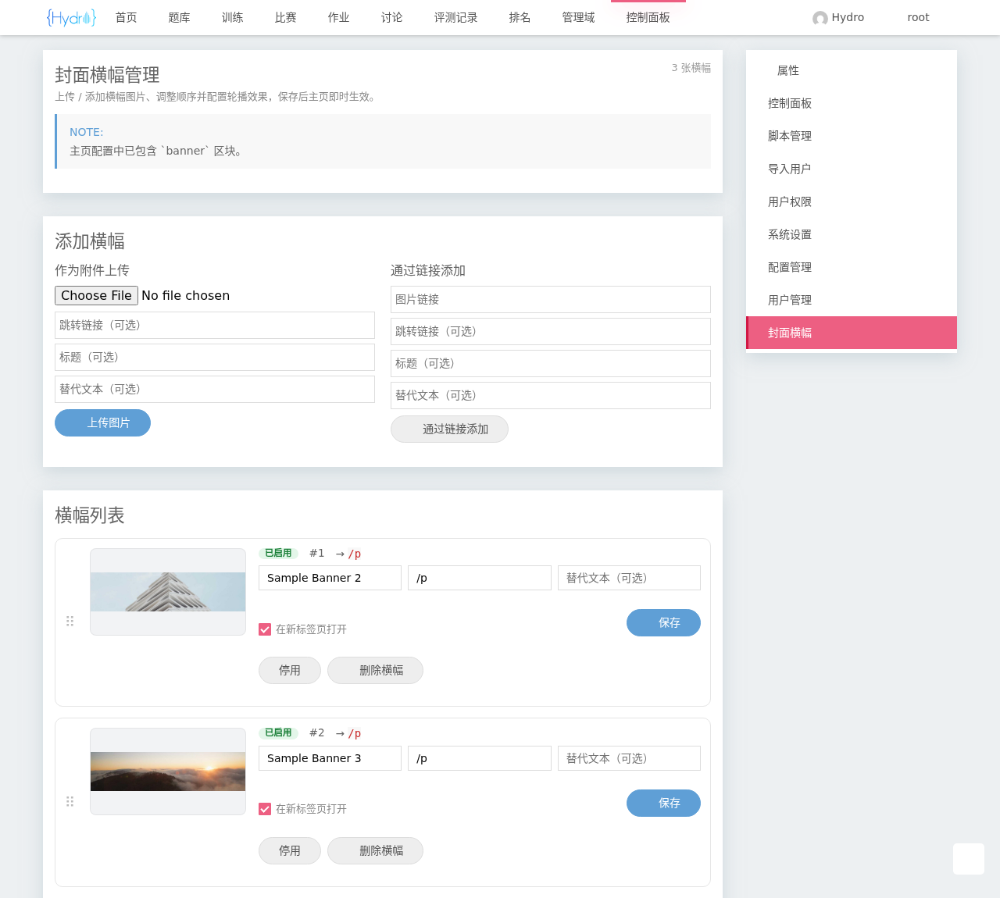

# @hydrooj/welcome-banner

**HydroOJ** 的可视化封面横幅管理插件 — 在后台控制面板中可视化上传、预览、排序、配置首页轮播横幅，无需手写 JSON 配置。

> 入口：登录管理员账号后，进入控制面板，右侧属性栏 **封面横幅管理** 标签（`/manage/banner`）

## 功能展示

首页横幅轮播效果：


后台可视化管理页面：



## 环境要求

- HydroOJ v5.x

> ⚠️ **安装后必须再改一处配置横幅才会显示！** 插件本身只提供管理页面，横幅是否出现在首页取决于首页配置 `hydrooj.homepage` 中是否有 `banner` 区块。装好后请务必完成下面的 [主页配置](#主页配置)（推荐用管理页里的一键按钮）。

## 部署

### 方式 A：从 Release 一行安装（推荐）

以运行 HydroOJ 的用户身份执行：

```bash
hydrooj install https://github.com/DotRacel/hydro-welcome-banner/releases/download/v2.0.0/hydrooj-welcome-banner-2.0.0.tgz
pm2 restart hydrooj      # 或以你的方式重启 hydrooj 进程
```

> 最新版本号见 [Releases](https://github.com/DotRacel/hydro-welcome-banner/releases)。

### 方式 B：git clone + 一键脚本

```bash
git clone https://github.com/DotRacel/hydro-welcome-banner.git ~/.hydro/addons/welcome-banner
cd ~/.hydro/addons/welcome-banner
./deploy.sh          # 自动 hydrooj addon add + pm2 restart hydrooj
```

更新：

```bash
cd ~/.hydro/addons/welcome-banner && git pull && pm2 restart hydrooj
```

### 方式 C：手动注册

```bash
hydrooj addon add /path/to/hydro-welcome-banner
pm2 restart hydrooj
```

## 主页配置

> **这一步是必需的**，否则横幅不会出现在首页。

横幅会在首页配置 `hydrooj.homepage` 中出现 `banner` 区块的位置渲染。有两种方式：

**方式一（推荐）：** 打开 **封面横幅管理** 页面，点击顶部的「一键将 `banner` 加入主页」按钮，插件会自动把 `banner` 写入首页配置。

**方式二（手动）：** 进入 *控制面板 → 系统设置 → `hydrooj.homepage`*，在某一列里加入 `banner` 这个顶层键（注意当前版本 HydroOJ 是用顶层键作为区块名，不是旧文档里的 `sections:` 数组）：

```yaml
- width: 9
  banner: true          # ← 加这一行
  bulletin: true
  contest: 5
  # ...其余保持不变
- width: 3
  # ...
```

保存后刷新首页即可看到横幅。之后所有的增删改、排序、开关都在 **封面横幅管理** 页面完成，无需再动配置文件。

## 卸载

```bash
hydrooj addon remove ~/.hydro/addons/welcome-banner
pm2 restart hydrooj
```

## License

AGPL-3.0-or-later
